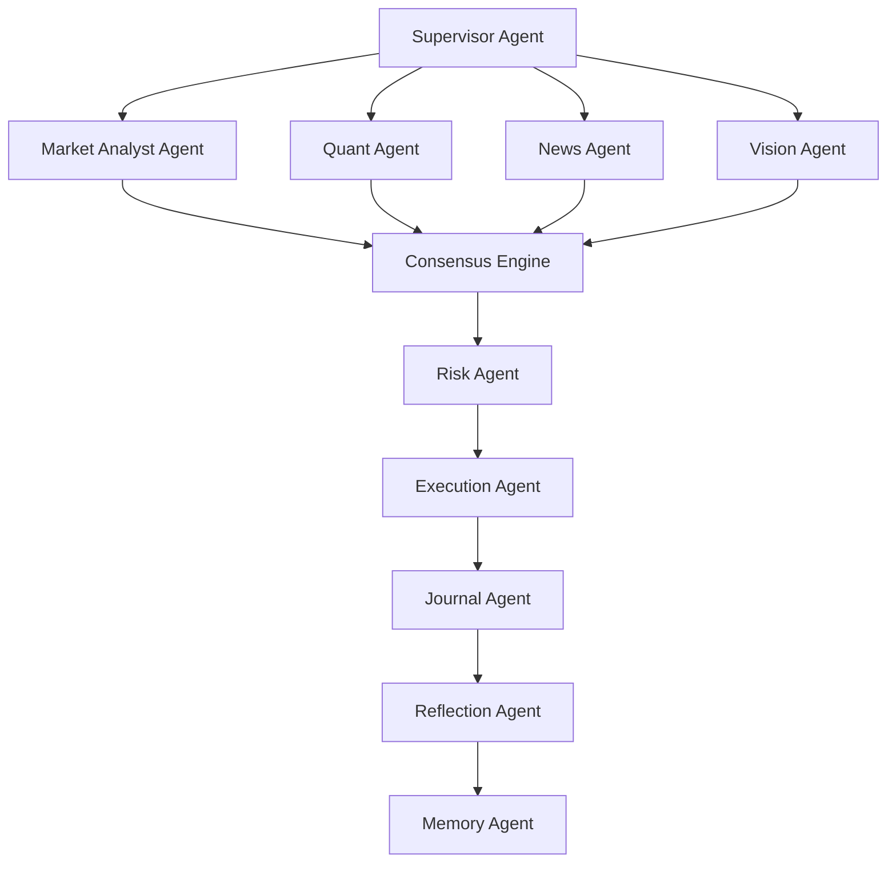

# ARES AI — Autonomous Research Execution System

ARES AI is an institutional-grade, fully autonomous multi-agent AI trading platform. It orchestrates a roster of 10 specialized AI agents in a directed graph (using LangGraph) to analyze financial markets, manage portfolio risk, execute trades, and continuously learn from historical outcomes.

Designed for resilience and offline-first/graceful degradation, ARES AI is configured to run entirely on **free-tier AI models** (via OpenRouter or OpenCode APIs) and uses a layered microservice architecture containerized with Docker.

---

## 🧠 Multi-Agent Pipeline & Architecture

ARES AI uses a directed graph to coordinate its agents. Each agent receives a strictly validated Pydantic state slice rather than free-form text, ensuring reliable orchestration even with smaller model sizes.



### The 10 Specialized Agents
1. **Supervisor**: Coordinates the agent state flow and acts as the router.
2. **Market Analyst**: Conducts technical analysis on price feeds.
3. **Quant**: Assesses quantitative metrics and statistical models.
4. **News**: Scrapes and analyzes sentiment from news feeds, Reddit, and RSS.
5. **Vision**: (Advisory) Analyzes chart images for pattern confirmation.
6. **Consensus Engine**: Aggregates inputs. Trade is valid ONLY if Market Analyst & Quant confidence > 80%, Risk Agent approves, and exposure limits are safe.
7. **Risk**: Evaluates max drawdown, portfolio exposure, and strategy boundaries.
8. **Execution**: Place orders securely on the target exchange.
9. **Journal**: Records decisions, rationale, and state post-trade.
10. **Reflection**: Post-trade analysis evaluating predictions against real outcomes.
11. **Memory**: Stores lessons learned, patterns, and historical reasoning.

---

## 🛠️ Technology Stack

* **Orchestration**: LangGraph, Pydantic
* **AI Fallbacks**: Built-in per-model circuit breakers & exponential backoff on OpenRouter / OpenCode.
* **Backend API**: FastAPI (Python 3.12+)
* **Database & Memory**: PostgreSQL (Data persistence), Redis (Caching & queueing), ChromaDB (Vector store for long-term memory)
* **Frontend**: Next.js, Vanilla CSS, TailwindCSS, Shadcn, TradingView Lightweight Charts
* **Landing Page**: Astro (Minimal tech glassmorphic presentation UI)
* **Infrastructure**: Docker, Docker Compose
* **Monitoring**: Prometheus, Grafana

---

## 🛡️ Safety Gates & Risk Management

ARES AI is built with strict safety gates that cannot be bypassed:
* **Human Approval Mode**: Enabled by default for all strategies. Autonomous live trading must be explicitly unlocked by a human operator.
* **Promotion Gate**: A trading strategy cannot go live until it has a minimum paper trading history of **30 trading days** or **50 closed paper trades** (whichever is longer) meeting risk thresholds.
* **Automatic Kill Switch**: Instantly halts all trading activity if max drawdown (default 20%) or exposure limits are breached.
* **Schema-Enforced I/O**: Every agent input/output is strictly validated. A validation failure automatically triggers correction or shifts to fallbacks; it *never* defaults to an approval.

---

## 🚀 Getting Started

### Prerequisites
Make sure you have the following installed on your machine:
* [Docker Desktop](https://www.docker.com/products/docker-desktop/)
* [Node.js & pnpm](https://nodejs.org/) (or npm/yarn)
* [Python 3.12+](https://www.python.org/)

### 1. Setup Environment Configuration
Copy the template configuration file to `.env`:
```powershell
cp .env.example .env
```
Open `.env` and fill in **either** your `OPENROUTER_API_KEY` or `OPENCODE_API_KEY` (which you can generate for free). Both are supported, but at least one is required to enable agent reasoning.

### 2. Start the Database & Cache Stack
Spin up the backing databases, cache, and vector store via Docker:
```powershell
docker-compose up -d
```
This runs:
* PostgreSQL on port `5432`
* Redis on port `6379`
* ChromaDB on port `8000`

### 3. Run Pipeline Simulation
Test that the entire Python agent graph is wired and executing successfully:
```powershell
python scripts/simulate_pipeline.py
```
This simulates a mock market event and walks the state through all 6 core stages.

### 4. Start the Web Dashboards

* **Landing Page (Astro)**:
  ```powershell
  cd landing
  npm install
  npm run dev
  ```
  Visit the landing page at `http://localhost:4321`.

* **Dashboard Application (Next.js)**:
  ```powershell
  cd frontend
  pnpm install
  pnpm dev
  ```
  Open the interactive dashboard at `http://localhost:3000`.

---

## 🧪 Testing & Validation

Run the full pytest suite to verify no regressions in the agent graph, endpoints, or DB layer:
```powershell
python -m pytest tests/ -v
```
Currently, all **760+ tests** pass cleanly with over **86% coverage**.
